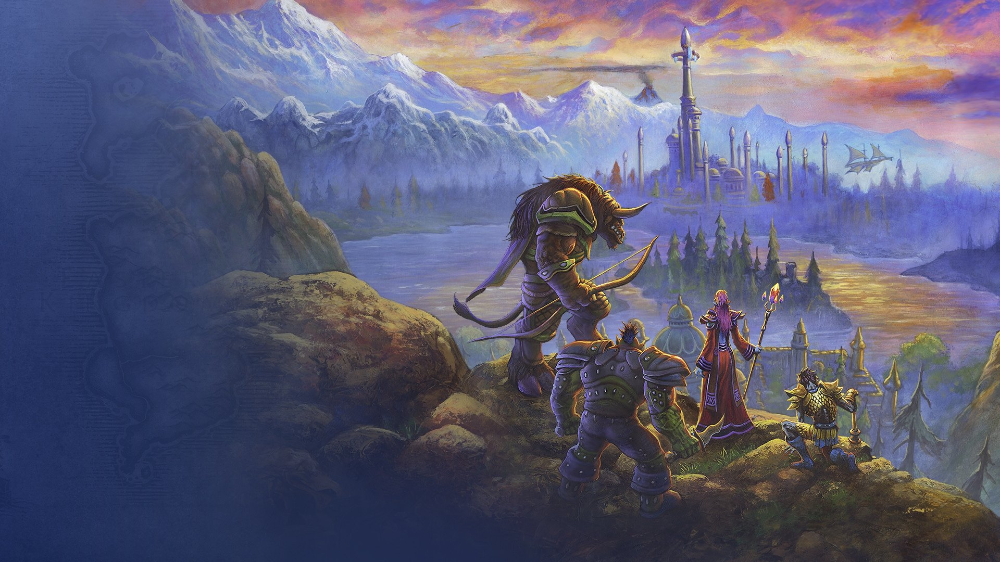

# GeekOS — Adventure. Forever.

A fan-made desktop operating system built as a love letter to the original world of Azeroth and to **World of Warcraft: Forever**, launching **November 4, 2026 at 3:00 PM PST**.

It boots, you pick a character, and you get a full desktop: window manager, action bar, Hearth menu, 25 apps, official Blizzard key art as living vistas, official game icons, a generative tavern band, a Battle.net Armory, and 33 achievements (14 of them hidden).



## Run it

```bash
npm install
npm run dev          # web: http://localhost:5173
```

```bash
npm run desktop      # builds, then opens GeekOS as an Electron desktop app
npm run dist         # produces a Windows installer + portable .exe in ./release
```

`npm run dist:all` builds Windows, macOS (dmg) and Linux (AppImage) targets when run on a machine that can sign them.

## What is inside

| App | What it does |
| --- | --- |
| Herald | Official Blizzard news, refreshed automatically by the content cron; Forever posts highlighted |
| Forever Countdown | Live countdown to launch, progress from reveal to launch, next roadmap milestones |
| Forever Codex | Everything Blizzard announced (zones, 9 dungeons, raids, Skyborne, systems, editions, dates) with official screenshots |
| Atlas of Azeroth | Stylised map with every Forever location pinned, zoom and pan, links into the Codex |
| Dungeon Journal | The nine dungeons and two raids, official screenshots, a loot-roll toy |
| Calendar | The full roadmap (beta, name reservation, launch, first raid, collection end) plus your own events and the official roadmap graphic |
| Quest Log | System-tracked story chain and daily quests whose objectives complete from real activity, plus your own to-do quests |
| Mailbox | Letters from NPCs with attachments, plus notes to yourself |
| Bags | A file explorer with folders (bags), scrolls, vistas, songs, quality colours and a Grave |
| Scribe | Parchment text editor bound to the Bags |
| Command Console | A chat-frame terminal: `/help`, `/dance`, `/played`, `/roll`, `/who`, `/lore`, `/wall`, and commands that are not listed |
| Guild Hall | `<Forever Ready>` guild chat with guildmates who answer you |
| Jukebox | Five original procedural tracks composed live with WebAudio; never the same twice |
| Armory | Look up real characters through the official Battle.net API and mirror them onto your desktop |
| Camp | A focus timer built on the Camping system; sessions grant buffs and rested XP |
| Hearthstone | Return home (minimizes everything) on a 30 minute cooldown; something is carved underneath |
| Talents & Profile | Your character sheet, titles, and OS preferences laid out as a talent tree that unlocks as you level |
| Achievements | 33 achievements, 14 hidden with hints |
| Gnomish Sweeper | Minesweeper, three difficulties, best times |
| Karazhan Chess | Full chess against a 3-ply alpha-beta engine (castling, en passant, promotion) |
| Goblin Abacus | Calculator with a gold/silver/copper mode |
| Portal | A small browser for the sites that allow being framed |
| Vistas | Browse and set the 30 official wallpapers |
| Settings | Vistas, sound, interface presets (including a Classic 2004 preset), Battle.net, data export/import |

The OS levels you up as you use it. Reach 60 and something changes.

## Keyboard

| Keys | Action |
| --- | --- |
| Alt+Space | Hearth menu |
| Alt+` | Command Console |
| Alt+1…9 | Action bar slots |
| Alt+D | Show desktop |
| Alt+F4 | Close window |
| F7 | Next vista |
| ↑↑↓↓←→←→BA | … |

## Always updated

GeekOS keeps itself current on three levels:

1. **Content cron (every 6 hours)**: a GitHub Actions job ([.github/workflows/content.yml](.github/workflows/content.yml)) runs `scripts/update-content.mjs`, which reads Blizzard's official news listing and the Forever page and commits `public/data/manifest.json` when something changed. The running app fetches that manifest from the repository every 30 minutes, so the Herald, the launch countdown and the roadmap update without a reinstall. New Forever articles arrive as a notification.
2. **Daily cloud agent (9:00 Paris)**: a scheduled Claude Code routine reviews Blizzard's Forever announcements, compares them with the Codex, calendar and manifest, and opens a pull request with the changes and their official sources. Nothing lands on `main` without review.
3. **App updates**: the desktop build checks GitHub Releases on start and every 6 hours (electron-updater) and installs the next version on restart. `npm run release` tags a version; the release workflow builds Windows, macOS and Linux packages. The web build is always the latest deployment.

Quests are tracked by the system too: story and daily objectives complete themselves from what you actually do (open the Console, read the Codex, win a Sweeper game), and the next quest in the chain is offered when one completes. Only your own quests have manual checkboxes.

## Battle.net Armory

GeekOS can pull real characters through the official Battle.net Profile API. Blizzard requires a client secret for the token exchange, so the secret never lives in front-end code. Three proxies are built in:

- **Electron**: the main process does the token exchange; credentials are stored encrypted in the app's user data folder.
- **Vite dev server**: `/api/bnet` middleware reads `BNET_CLIENT_ID` / `BNET_CLIENT_SECRET` from `.env.local`.
- **Vercel**: `api/bnet.ts` is a serverless function using the same environment variables.

Steps:

1. Create an API client at https://develop.battle.net/ (needs a Battle.net account with an authenticator).
2. Either put the credentials in `.env.local` (copy `.env.example`), or paste them into **Settings → Battle.net** inside GeekOS.
3. Open the **Armory**, choose region and game version, enter realm and character name.

Modern and Classic characters work today. World of Warcraft: Forever has no published API namespace yet; the Armory has a Forever option that will start working if Blizzard ships one after launch.

## Art and credits

- Vistas, logo, and icons are Blizzard's official World of Warcraft: Forever key art, screenshots from the reveal and What's Next panel, and game icons served from `render.worldofwarcraft.com`. They are used non-commercially as fan content. World of Warcraft, Warcraft, Blizzard and related marks are trademarks of Blizzard Entertainment, Inc. GeekOS is unofficial and not affiliated with or endorsed by Blizzard.
- Fonts: Cinzel, Open Sans, MedievalSharp, Uncial Antiqua (SIL Open Font License), self-hosted.
- Interface, sounds and music are original and synthesized at runtime (WebAudio). No audio is sampled from the game.
- Engine: Vite + TypeScript, no frameworks. Electron for the desktop build.

## Project layout

```
src/os/        kernel, window manager, shell, wallpapers, icons, sound, achievements, filesystem, Battle.net client
src/apps/      one file per app
src/data/      the Forever Codex data
src/style/     tokens, base, shell, modes, art
public/art/    official key art and screenshots
public/icons/  official game icons (56px)
electron/      desktop shell (main + preload)
server/, api/  Battle.net proxy (shared logic, Vercel function)
```

Everything persists in `localStorage` (characters, quests, mail, bags, achievements, settings). **Settings → Data** exports and imports a full backup. `/reset everything` in the Console wipes it.
